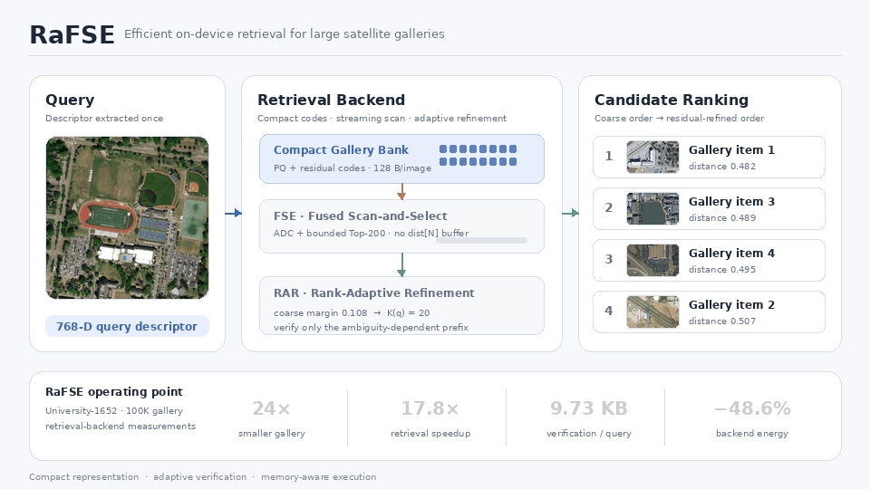

# RaFSE
<p align="center">
  
</p>

Official implementation of RaFSE for large-scale drone-to-satellite retrieval
on University-1652.

This repository provides the canonical gallery construction protocol, frozen
Dynamic-K configurations, retrieval code, and evaluation utilities used for
the University-1652 experiments. Datasets, descriptors, labels, model weights,
and generated indexes are not distributed in this repository.

## Installation

The reference environment uses Python 3.9, NumPy 1.26.4, SciPy 1.13.1,
Faiss 1.13.0, and 16 Faiss threads.

```bash
python -m pip install -e '.[faiss,test]'
```

## Data preparation

Place locally generated descriptors under `workspace/features/`:

```text
workspace/features/features.mat
workspace/features/train_drone_features.npy
workspace/features/train_satellite_features.npy
```

`features.mat` must contain `query_features`, `gallery_features`,
`query_labels`, and `gallery_labels`. All descriptors are 768-dimensional,
float32, and L2-normalized. See `docs/DATA.md` for the expected shapes.

## Build University-1652 galleries

```bash
python scripts/build_u1652_gallery.py \
  --eval-mat workspace/features/features.mat \
  --train-drone workspace/features/train_drone_features.npy \
  --train-satellite workspace/features/train_satellite_features.npy \
  --output-dir workspace/galleries \
  --scales 100000 1000000
```

The original 951 satellite descriptors are retained. Additional gallery items
are sampled with replacement from the concatenated training-drone and
training-satellite descriptor pool using seed 42.

## Run RaFSE

For the 100K gallery:

```bash
python scripts/reproduce_100k_table.py \
  --eval-mat workspace/features/features.mat \
  --gallery-features workspace/galleries/gallery_100000_features.npy \
  --gallery-labels workspace/galleries/gallery_100000_labels.npy \
  --train-drone workspace/features/train_drone_features.npy \
  --train-satellite workspace/features/train_satellite_features.npy \
  --thresholds configs/thresholds/dynamic_k_100k.json \
  --output-dir workspace/runs/rafse_100k
```

For the 1M gallery, use `scripts/reproduce_1m_table.py`, the 1M gallery files,
and `configs/thresholds/dynamic_k_1m.json`.

Each run returns exactly 200 gallery IDs per query and reports R@1, R@5, and
University-1652 AP@200. Generated artifacts are written under `workspace/`,
which is excluded from version control.

## Paper results

The aggregate values reported in the paper are provided in
`results/paper_results.csv`.

## License

Released under the Apache License 2.0. Please cite the associated RaFSE paper
when using this code.
